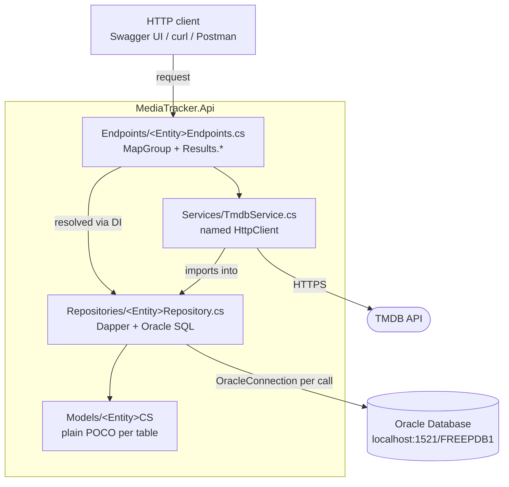
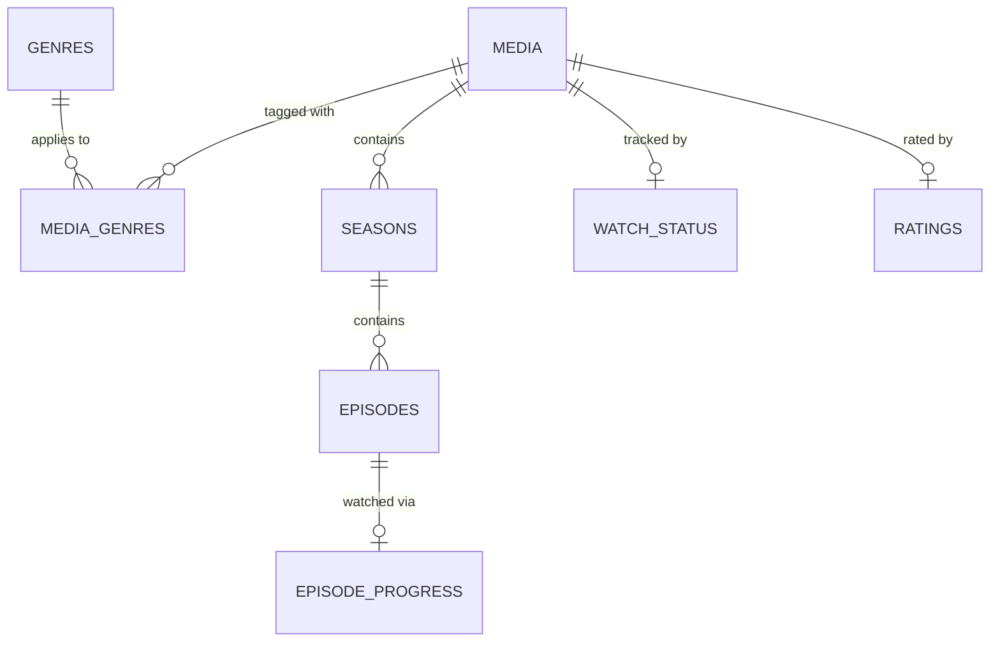

# Media Tracker

A Trakt-style tracking API for TV shows and movies. Built with **ASP.NET Core 10** minimal APIs and **Oracle Database**, with **Dapper** for data access and the **TMDB API** as an external metadata source.

[](https://dotnet.microsoft.com/)
[](https://learn.microsoft.com/aspnet/core/)
[](https://www.oracle.com/database/)
[](https://dapper-library.github.io/Dapper/)
[](https://developer.themoviedb.org/docs)

Personal project, built deliberately as a portfolio piece to demonstrate C#/.NET and Oracle work end to end.

---

## Contents

- [What it does](#what-it-does)
- [Features](#features)
- [Tech stack](#tech-stack)
- [Architecture](#architecture)
- [Data model](#data-model)
- [API surface](#api-surface)
- [Oracle specifics](#oracle-specifics)
- [Getting started](#getting-started)
- [What you can learn from this](#what-you-can-learn-from-this)
- [Project layout](#project-layout)
- [Roadmap](#roadmap)

---

## What it does

Track the media you want to watch, are watching, have finished, or have dropped. A single `media` row represents either a movie or a show; shows get nested seasons, which get nested episodes. Metadata can be pulled straight from TMDB and imported into the local database instead of being typed in by hand.

## Features

| Area | Capability |
| --- | --- |
| Media library | Create, browse, update and delete movies and shows; many-to-many genre tagging |
| Shows | Nested seasons and episodes, addressed as real REST resources |
| Progress tracking | Per-media watch status, upserted in a single database call |
| Episode progress | Mark individual episodes watched or unwatched; completing a season auto-completes the show |
| Ratings | Score and review per media item, same upsert semantics |
| TMDB integration | Import a real movie or show straight from TMDB by ID, including its seasons and episodes |
| API docs | Swagger UI and an OpenAPI document, development only |
| Secrets handling | Connection string and API key kept out of source control entirely |

## Tech stack

| Layer | Choice | Why |
| --- | --- | --- |
| Framework | .NET 10, minimal APIs | No controllers, no MVC ceremony |
| Database | Oracle Database Free (Docker, `gvenzl/oracle-free`) | Deliberate target: far less common than SQL Server or Postgres |
| Data access | Dapper 2.1 | Hand-written SQL with object mapping, chosen over EF Core for direct control and Oracle fit |
| Driver | Oracle.ManagedDataAccess.Core (ODP.NET) | Microsoft-managed Oracle driver, no Instant Client install |
| API docs | Swashbuckle.AspNetCore | Added by hand; the .NET 10 template ships no Swagger UI |
| External API | TMDB v3 | Movie and show metadata source |
| Secrets | dotnet user-secrets | Repo is public, so nothing sensitive is committed |

## Architecture

Every entity follows the same three-layer slice, with no exceptions:



- `Models/` — plain classes mirroring the tables, one per entity.
- `Repositories/I<Entity>Repository.cs` — the contract, so endpoints depend on an abstraction.
- `Repositories/<Entity>Repository.cs` — Dapper queries and Oracle SQL.
- `Endpoints/<Entity>Endpoints.cs` — a static class exposing `Map<Entity>Endpoints(this WebApplication)`, grouping routes with `MapGroup`.
- `Program.cs` — wires each repository as scoped and maps each endpoint group. Adding an entity means two lines here.

Repositories take `IConfiguration`, read `ConnectionStrings:OracleDb`, and open a fresh `OracleConnection` per method. There is no connection factory, unit of work, or ORM change-tracking layer.

## Data model



| Table | Purpose |
| --- | --- |
| `media` | One row per movie or show; `media_type` is `MOVIE` or `SHOW` |
| `genres` | Reusable genre names |
| `media_genres` | Many-to-many bridge between media and genres |
| `seasons` | Seasons belonging to a show, unique per `(media_id, season_number)` |
| `episodes` | Episodes within a season, unique per `(season_id, episode_number)` |
| `episode_progress` | Which individual episodes have been watched |
| `watch_status` | Overall status per media item: `PLAN_TO_WATCH`, `WATCHING`, `COMPLETED`, `DROPPED` |
| `ratings` | Score and review per media item |

Schema source: [`database/schema.sql`](database/schema.sql).

## API surface

| Method | Route | Purpose |
| --- | --- | --- |
| `GET` | `/media` | List all media |
| `GET` | `/media/{id}` | Get one media item |
| `POST` | `/media` | Create a media item |
| `PUT` | `/media/{id}` | Update a media item's own fields |
| `DELETE` | `/media/{id}` | Delete a media item and everything under it |
| `GET` | `/media/{id}/genres` | Genres for a media item |
| `POST` | `/media/{id}/genres/{genreId}` | Tag a media item with a genre |
| `GET` | `/media/{mediaId}/seasons` | Seasons for a show |
| `POST` | `/media/{mediaId}/seasons` | Add a season |
| `DELETE` | `/media/{mediaId}/seasons/{seasonId}` | Delete a season and its episodes |
| `GET` | `/media/{mediaId}/seasons/{seasonId}/episodes` | Episodes in a season |
| `POST` | `/media/{mediaId}/seasons/{seasonId}/episodes` | Add an episode |
| `DELETE` | `/media/{mediaId}/seasons/{seasonId}/episodes/{episodeId}` | Delete an episode |
| `GET` | `/media/{mediaId}/seasons/{seasonId}/progress` | Episodes in the season that are watched |
| `GET` | `/media/{mediaId}/seasons/{seasonId}/episodes/{episodeId}/progress` | Watch status for one episode |
| `PUT` | `/media/{mediaId}/seasons/{seasonId}/episodes/{episodeId}/progress` | Mark an episode watched; completing the season marks the show `COMPLETED` |
| `DELETE` | `/media/{mediaId}/seasons/{seasonId}/episodes/{episodeId}/progress` | Mark an episode unwatched |
| `GET` | `/media/{mediaId}/watch-status` | Current watch status |
| `PUT` | `/media/{mediaId}/watch-status` | Set watch status (upsert) |
| `GET` | `/media/{mediaId}/rating` | Current rating |
| `PUT` | `/media/{mediaId}/rating` | Set rating and review (upsert) |
| `GET` | `/genres` | List genres |
| `GET` | `/genres/{id}` | Get one genre |
| `POST` | `/genres` | Create a genre |
| `DELETE` | `/genres/{id}` | Delete a genre |
| `POST` | `/tmdb/import?tmdbId=&type=` | Import a movie or show from TMDB as a media row |
| `POST` | `/tmdb/import-seasons?mediaId=` | Import a show's seasons and episodes from TMDB |

`type` is `movie` or `tv` on the TMDB route and is translated to the database's `MOVIE`/`SHOW` before insert.

## Oracle specifics

The database was picked precisely because it is the awkward one, so the Oracle-flavoured parts are the interesting part of the codebase.

| Concern | Approach here |
| --- | --- |
| Bind parameters | `:Name`, not `@Name` |
| Getting the new primary key | `RETURNING <col> INTO :NewId` plus a Dapper `DynamicParameters` entry with `ParameterDirection.Output` |
| Upserts | `MERGE INTO ... USING (SELECT :p AS col FROM dual) ... WHEN MATCHED / WHEN NOT MATCHED` for `watch_status`, `ratings`, `seasons` and `episodes` |
| Column mapping | Every `SELECT` aliases snake_case columns to PascalCase (`media_id AS MediaId`) because Oracle returns uppercase column names |
| Deletes | Rely on `ON DELETE CASCADE` rather than manual child cleanup, verified level by level against the running database |
| Timestamps | `SYSDATE` |

## Getting started

Prerequisites: .NET 10 SDK, Docker Desktop, a [TMDB](https://developer.themoviedb.org/docs) API key.

**1. Start Oracle**

```bash
docker run -d --name media-tracker-db \
  -e ORACLE_PASSWORD=<oracle-password> \
  -e APP_USER=media_app -e APP_USER_PASSWORD=<app-password> \
  -p 1521:1521 gvenzl/oracle-free
```

The container does not auto-start after a reboot; use `docker start media-tracker-db` (check with `docker ps -a`). Give it a minute to report `DATABASE IS READY TO USE!` in `docker logs -f media-tracker-db`.

**2. Create the schema**

Run [`database/schema.sql`](database/schema.sql) as `media_app` in your SQL client. If you use the Oracle SQL Developer extension for VS Code, use **Run Script**, not **Run Statement** — otherwise only the first statement runs and the remaining tables are silently skipped.

**3. Store the secrets locally**

Nothing sensitive belongs in `appsettings.json`; this repo is public. `UserSecretsId` is already set in the csproj, so `dotnet user-secrets init` is not needed.

```bash
dotnet user-secrets set "ConnectionStrings:OracleDb" "User Id=media_app;Password=<app-password>;Data Source=localhost:1521/FREEPDB1"
dotnet user-secrets set "Tmdb:ApiKey" "<your-tmdb-v3-key>"
```

**4. Run it**

There is no solution file, so target the project explicitly:

```bash
dotnet run --project MediaTracker.Api
```

The API listens on `http://localhost:5165`. Swagger UI is at `/swagger` in the Development environment.

> There is no test project yet. `dotnet build MediaTracker.Api` is the only automated check available.

## What you can learn from this

- **Minimal API architecture** — how little ceremony is needed to structure a real API around route groups, typed `Results.*` responses, and constructor injection.
- **Repository pattern with DI** — interfaces per entity, scoped lifetimes, and why the endpoints never touch SQL.
- **Dapper in anger** — parameter binding, multi-row queries, and reading generated identity values back out of Oracle without an ORM.
- **SQL the ORM would hide** — `MERGE` upserts, `RETURNING ... INTO`, identity columns, `CHECK` constraints, and `ON DELETE CASCADE` doing the referential work.
- **Oracle naming behaviour** — why unmapped snake_case columns come back uppercase and quietly break naive object mapping.
- **Third-party API integration** — typed `HttpClient` via `IHttpClientFactory`, named clients, `System.Text.Json` deserialization, and translating between two different domain vocabularies (`movie`/`tv` versus `MOVIE`/`SHOW`).
- **Debugging a real network bug** — TMDB calls hung for 100 seconds on the author's machine because `HttpClient` resolved DNS over IPv6 first. The fix in `Program.cs` overrides `ConfigurePrimaryHttpMessageHandler` to force IPv4 sockets, which is a good look at how a seemingly unrelated infrastructure quirk presents as an application-level timeout.
- **Secret management** — keeping connection strings and API keys in user-secrets so a public repository stays safe.

## Project layout

```
media-tracker/
├── database/
│   └── schema.sql              all 8 tables, run once as media_app
├── MediaTracker.Api/
│   ├── Models/                 POCOs mirroring the tables (+ Models/Tmdb/)
│   ├── Repositories/           I<Entity>Repository.cs + <Entity>Repository.cs
│   ├── Endpoints/              one static class per entity
│   ├── Services/               ITmdbService.cs / TmdbService.cs
│   ├── Program.cs              DI registration and endpoint mapping
│   ├── MediaTracker.Api.http   runnable request samples
│   └── Properties/launchSettings.json
└── README.md
```

## Roadmap

Short version of what's next, roughly in order:

- A test project — there is none yet, and repository code opens `OracleConnection` directly by design, so it needs an approach worked out for Oracle rather than an in-memory substitute
- `docker-compose.yml` bringing up the API and Oracle together in one command
- Season and episode `PUT` endpoints, to match what media items already have
- Downgrading a show from `COMPLETED` back to `WATCHING` when an episode is unmarked
